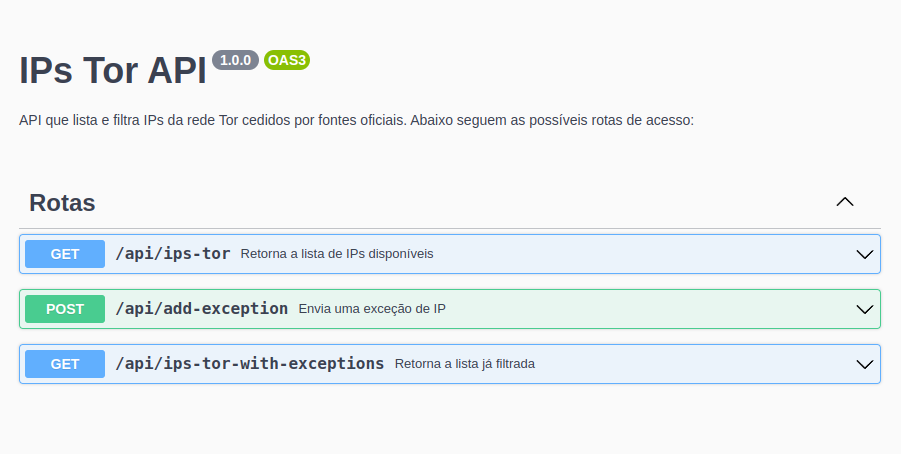

<h1 align="center">
<br>
    IPs Tor API
<hr>



</h1>

## Features

Abaixo estão todas as features usadas nesse projeto:

- **Typescript** — Superset Javascript
- **React & CRA** — Biblioteca Javascript e base de projeto
- **TailwindCSS** — Estilização
- **Express** — Server Framework Node
- **MongoDB & Mongoose** — Banco de dados NoSQL e biblioteca Javascript
- **node-localstorage** — Biblioteca Javascript
- **date-fns** — Biblioteca para manipulação de tempo, hora e data

<br>

## Instruções

No ato de clonar o repositório, um arquivo .env necessita ser criado com a porta e a url abaixo:

```
   PORT=5555
   MONGO_URL=mongodb://db:27017/exceptions
```

Execute o comando para compor os containers:

```
   docker-compose up
```

Caso surja um erro da porta do mongodb em uso, encerre o processo que usa a mesma e rode o comando acima novamente. Uma das formas será, por exemplo:

```
   sudo netstat -pna | grep 27017
   sudo kill -9 <PID>
```

```
   docker-compose up
```

**\_Obs.:** você pode usar a flag <em>-d</em> para rodar no background, ou deixar assim para obter algumas outras informações através do console. Caso precise, utilize <em>sudo</em> para ceder autorização ou <em>y</em> para aceitar algum pedido.</br>
**\_Lembrando.:** O [Docker](https://docs.docker.com/get-docker/) precisa estar instalado, assim como o [Docker compose](https://docs.docker.com/compose/install/) e também o [Node](https://nodejs.org/en/download/).

Após já estar rodando os containers, para acessar a aplicação, sua documentação ou o repositório no Github, siga um dos links abaixo:

<strong>Página da aplicação:</strong> [Clique aqui](http://localhost:3001) ou use http://localhost:3001<br>
<strong>Documentação:</strong> [Clique Aqui](http://localhost:5555/doc/) ou use http://localhost:5555/doc/ <br>
<strong>Github:</strong> [Clique Aqui](https://github.com/bastosgm/IPs-Tor-API) ou use https://github.com/bastosgm/IPs-Tor-API

<br>

## Referências

[Documentação do Node](https://nodejs.org/en/docs/)</br>
[Documentação do Typescript](https://www.typescriptlang.org/docs/)</br>
[Documentação do Express](https://expressjs.com)</br>
[Documentação do Mongoose](https://mongoosejs.com)</br>
[Documentação do Swagger](https://swagger.io/docs/specification/about/)</br>
[Fonte 1 dos IPs](https://www.dan.me.uk/tornodes)</br>
[Fonte 2 dos IPs](https://onionoo.torproject.org/summary?limit=5000)
